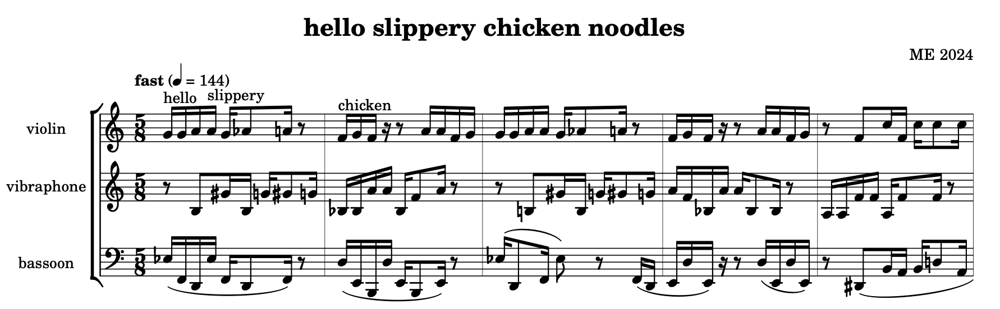

# slippery chicken

This is slippery-chicken, a Common Lisp and CLOS package for
algorithmic composition.

slippery chicken outputs sound files, reaper files MIDI files, and score 
files in PDF, Lilypond, and MusicXML formats. It also outputs
scores in [antescofo~](http://repmus.ircam.fr/antescofo) format for use with Arshia Cont's score
following external for Max/MSP.

The source code is available here in github. For more details 
about installation, 

Extensive documentation can be found at http://www.michael-edwards.org/sc

Since March 2024 slippery-chicken can be installed via Common Lisps ASDF mechanism. See the [install page](install.md)
for details. For the old method of installing via script or from source, 
see the [wiki page](https://github.com/mdedwards/slippery-chicken/wiki/how-to-install-slippery-chicken-'by-hand')

## hello slippery world



```
(let* ((num-seqs 55)
       (proc (procession num-seqs '(1 2 3 4)))
       (hello 
         (make-slippery-chicken
          '+hello-slippery+
          :composer "ME"
          :title "hello slippery chicken noodles"
          :year "2024"
          :tempo-map '((1 (q 144 "fast")))
          :ensemble '(((vln (violin :midi-channel 1))
                       (perc (vibraphone :midi-channel 4))
                       (bsn (bassoon :midi-channel 9))))
          :set-palette '((1 ((cs2 e2 d3 bf3 fs4 g4 gs4 a5)))
                         (2 ((c2 f2 ef3 b3 fs4 gs4 as4 g5)))
                         (3 ((e2 bf2 ef3 c3 bf3 fs4 cs5 g5 b5)))
                         (4 ((d2 b2 g3 f4 df5 af5 ef6))))
          :set-limits-high '((vln (0 c5 75 c7 100 c5))
                             (perc (0 a4 75 f6 100 a4))
                             (bsn (0 g3 75 a4 100 g3)))
          :set-limits-low '((vln (0 c4 75 g5 100 c4))
                            (perc (0 f3 75 g4 100 f3))
                            (bsn (0 bf1 75 g3 100 bf1)))
          :rthm-seq-palette '((1 ((((5 8) - s x 4 -  - s e s - (e)))
                                  :pitch-seq-palette ((1 2 5 4 1 3 6)
                                                      (5 3 2 6 4 1 2))))
                              (2 ((((5 8) - s s s - (s)  (e) - s x 4 -))
                                  :pitch-seq-palette ((1 3 2 6 4 2 3))))
                              (3 ((((5 8) (e) - e s s - - s e s -))
                                  :pitch-seq-palette ((1 4 2 3 6 3))))
                              (4 ((((5 8) - s e s -  e (e) - s s -))
                                  :pitch-seq-palette ((4 1 2 5 2 3)))))
          :title "16ths-a-go-go"
          :fast-leap-threshold 0.05
          :set-map `((1 ,proc))
          :rthm-seq-map `((1 ((vln ,proc)
                              (perc ,(wrap-list proc 4))
                              (bsn ,(wrap-list proc 7))))))))
  (rm-repeated-pitches hello 'bsn)
  (add-mark-to-note hello 1 1 'vln "hello")
  (add-mark-to-note hello 1 4 'vln "slippery")
  (add-mark-to-note hello 2 1 'vln "chicken")
  (lp-display hello)
  (write-xml hello)
  (midi-play hello))
```
Via Lilypond this produces a [lovely score](doc/media/_hello-slippery-chicken-noodles-score.pdf).
We could listen to the piece with instrument approximations using Dorico or something but I quite
like the MIDI file render made with [pianoteq 7's](https://www.modartt.com/pianoteq_overview)
elektric piano *MKII Flower Power*: [listen](doc/media/sc-noodles.mp3)

<a href="example.com" target="_blank">New Tab</a>

Michael Edwards (m@michael-edwards.org)
